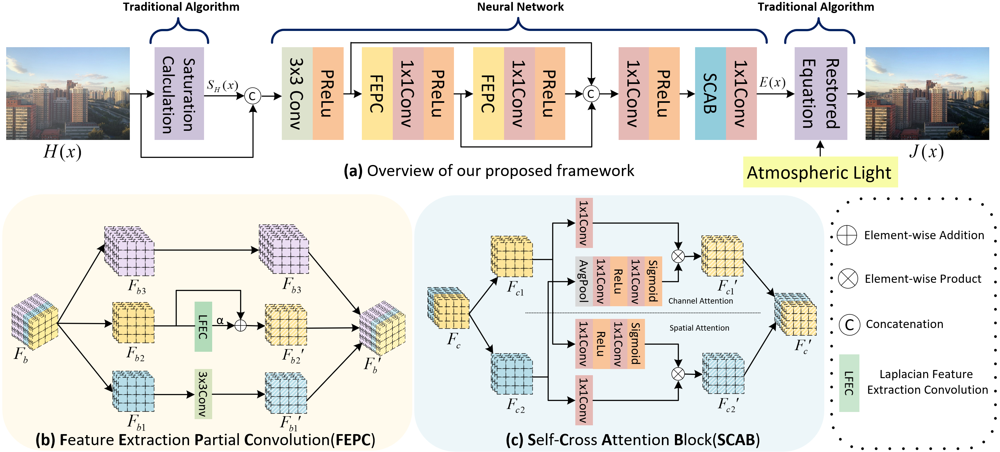
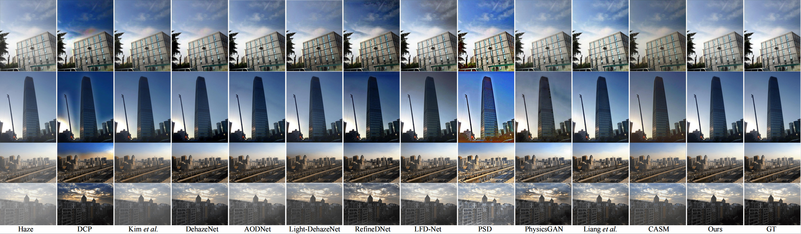
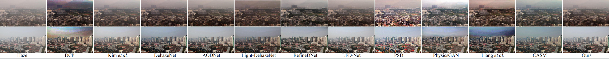

---

# A Fast Saturation Based Dehazing Framework with Accelerated Convolution and Attention Block

**Shuocheng Wang, Jiaming Liu, Yilian Zhong, Ruoxi Zhu, Jiazheng Lian, Hao Zhang, Yibo Fan*** 
**State Key Laboratory of Integrated Chips and Systems, Fudan University**

***ICASSP 2025***

## Abstract

Real-time image dehazing is crucial for applications such as autonomous driving, surveillance, and remote sensing, where haze can significantly reduce visibility. However, many deep learning algorithms are hindered by large model sizes, making real-time processing difficult to achieve. Several fast and lightweight dehazing networks rely on estimating K(x), but they often fail to deliver satisfying performance. In this paper, we present a novel fast dehazing framework built upon the saturation-based algorith  m. We design a new convolution module called Feature Extraction Partial Convolution (FEPC), which is faster and achieves better performance than the vanilla 3x3 convolution. Additionally, we fully leverage the information redundancy between feature map channels by dividing it into two parts along the channel dimension and designing a Self-Cross Attention Block (SCAB). The reduction in channel count significantly reduces computational load and improves the framework's speed. Through extensive experiments, our method demonstrates not only a fast inference speed but also superior dehazing performance, providing a promising solution for real-time practical deployment. Our code is available at https://github.com/superwsc/FSB-Dehazing-Framework.

## Framework Overview



## Results

Visual qualitative comparison on the synthetic datasets. The first two rows correspond to the SOTS-outdoor dataset, while the third row and fourth row correspond to the HSTS-synthetic dataset.



Visual qualitative comparison on the real-world hazy images.



## Installation

For installing, follow these instructions

```
sudo apt-get install cmake build-essential libjpeg-dev libpng-dev
conda create -n pytorch1 python=3.7
conda activate pytorch1
conda install pytorch=1.1 torchvision=0.3 cudatoolkit=9.0 -c pytorch
pip install matplotlib scikit-image opencv-python yacs joblib natsort h5py tqdm

```

## Training

Train your model with default arguments by running

```
python train.py
```

Training arguments can be modified in 'training.yml'.

## Inference

Conduct model inference by running

```
python inference.py --input_dir /[GT_PATH] --result_dir /[GENERATED_IMAGE_PATH]  --save_images
```

## Evaluation (PSNR, SSIM, LPIPS)

```
python evaluation.py -dir_A /[GT_PATH] -dir_B /[GENERATED_IMAGE_PATH] 
```

##  If you find our code or paper useful, please cite as

```bibtex
@INPROCEEDINGS{10889261,
  author={Wang, Shuocheng and Liu, Jiaming and Zhong, Yilian and Zhu, Ruoxi and Lian, Jiazheng and Zhang, Hao and Fan, Yibo},
  booktitle={ICASSP 2025 - 2025 IEEE International Conference on Acoustics, Speech and Signal Processing (ICASSP)}, 
  title={A Fast Saturation Based Dehazing Framework with Accelerated Convolution and Attention Block}, 
  year={2025},
  volume={},
  number={},
  pages={1-5},
  keywords={Deep learning;Image quality;Convolution;Surveillance;Redundancy;Signal processing algorithms;Feature extraction;Real-time systems;Speech processing;Remote sensing;Image Dehazing;Deep Learning;Saturation-Based;Speed},
  doi={10.1109/ICASSP49660.2025.10889261}}

```

---

